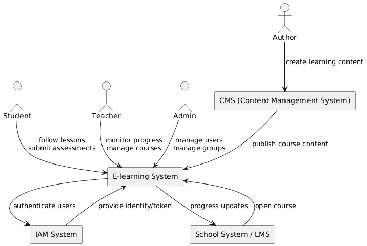
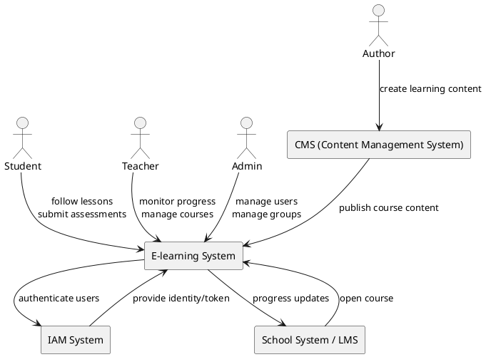
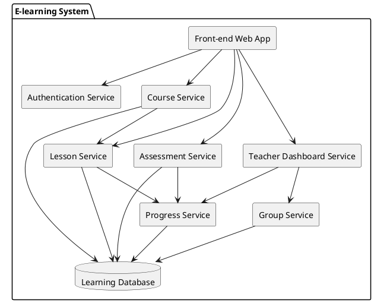
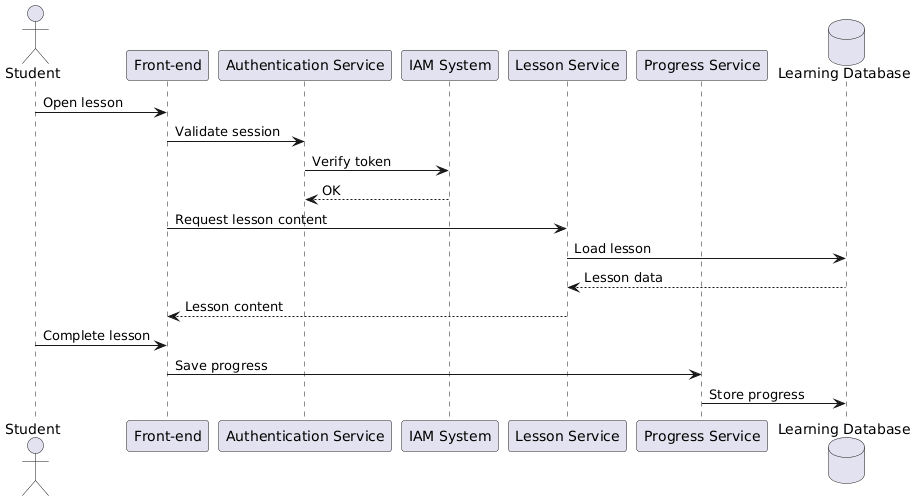
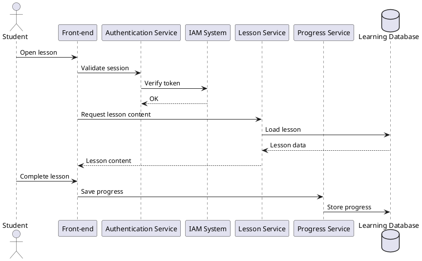

# ISQB-CSPSA-F-Team-Red
Some fun exercise workouts of Team Red.

## Exercise 5: Create Three Views

This section presents three architectural views of the e-learning system: Context View, Component (Building Block) View, and Runtime View. These views provide different perspectives on the system's architecture, scope, and behavior.

### 1. Context View (System Context)

**Goal:** Show the e-learning system as a black box and its interactions with external actors and systems. It defines the system scope and external interfaces.

**What this diagram shows:**
* **The E-learning system**
* **External actors:** Student, Teacher, Admin, Author.
* **External systems:** IAM system, CMS, School/LMS system.

This represents the business context of the system.

---

### 2. Component View (Building Block View)

**Goal:** Show the internal structure of the e-learning system by decomposing it into components and their dependencies.

**Components Explained:**

| Component | Responsibility |
| :--- | :--- |
| **Front-end** | UI for students and teachers |
| **Authentication service** | Login and IAM integration |
| **Course service** | Manage courses |
| **Lesson service** | Deliver lesson content |
| **Assessment service** | Quizzes/tests |
| **Progress service** | Track student progress |
| **Teacher dashboard** | Teacher overview |
| **Group service** | Manage classes/groups |

---

### 3. Runtime View (Sequence Diagram)

**Goal:** Show runtime interaction between components during a specific scenario.

**Example scenario:** Student starts a lesson

**Scenario Flow:**
1. Student opens lesson.
2. System authenticates via IAM.
3. Lesson content is retrieved.
4. Student completes lesson.
5. Progress is stored.
