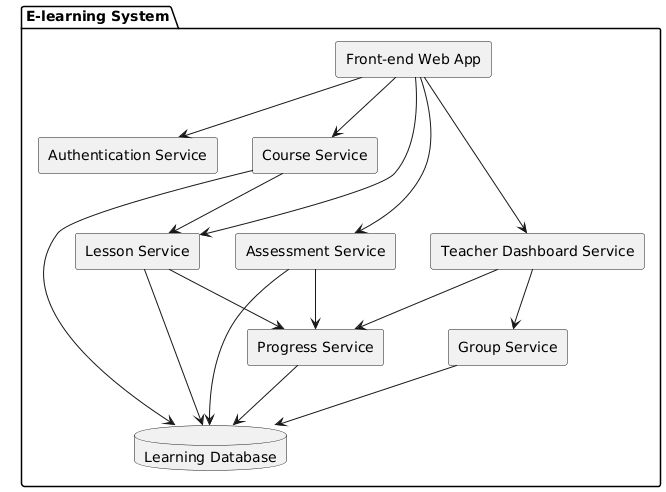
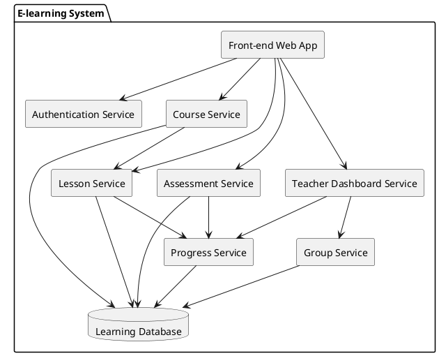

2️⃣ Component View (Building Block View)

Goal: Show internal structure of the e-learning system.

The building block view decomposes the system into components and their dependencies.

slides-day-2

PlantUML

**Components explained**

    Component	            Responsibility
    Front-end	            UI for students and teachers
    Authentication service	    login and IAM integration
    Course service	            manage courses
    Lesson service	            deliver lesson content
    Assessment service	    quizzes/tests
    Progress service	    track student progress
    Teacher dashboard	    teacher overview
    Group service	            manage classes/groups