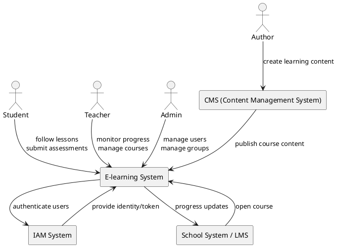

1️⃣ Context View (System Context)

Goal: Show the e-learning system as a black box and its interactions with external actors and systems.
A context view shows the system scope and external interfaces.

slides-day-2

PlantUML

**What this diagram shows**

The E-learning system

External actors:

    Student
    
    Teacher
    
    Admin
    
    Author

External systems:

    IAM system
    
    CMS
    
    School/LMS system

This is the business context of the system.