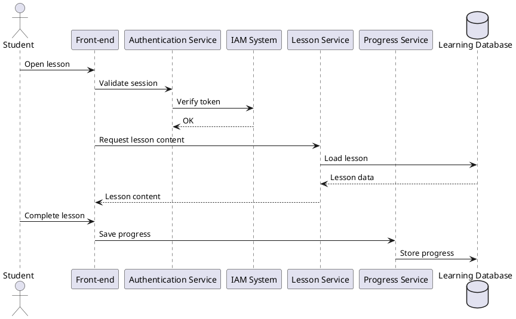

3️⃣ Runtime View (Sequence Diagram)

Goal: Show runtime interaction between components during a scenario.

Runtime views describe dynamic behavior such as interactions and workflows.

slides-day-2

Example scenario: Student starts a lesson

PlantUML

**Scenario flow**

    Student opens lesson
    
    System authenticates via IAM
    
    Lesson content retrieved
    
    Student completes lesson
    
    Progress stored